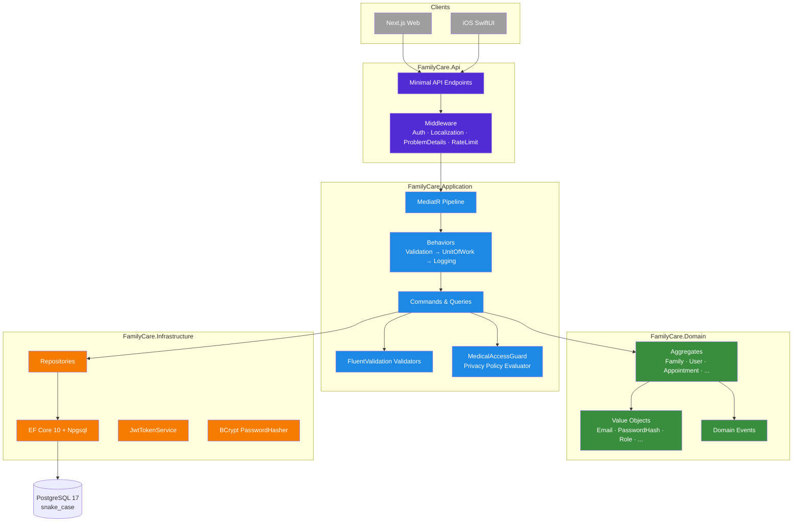
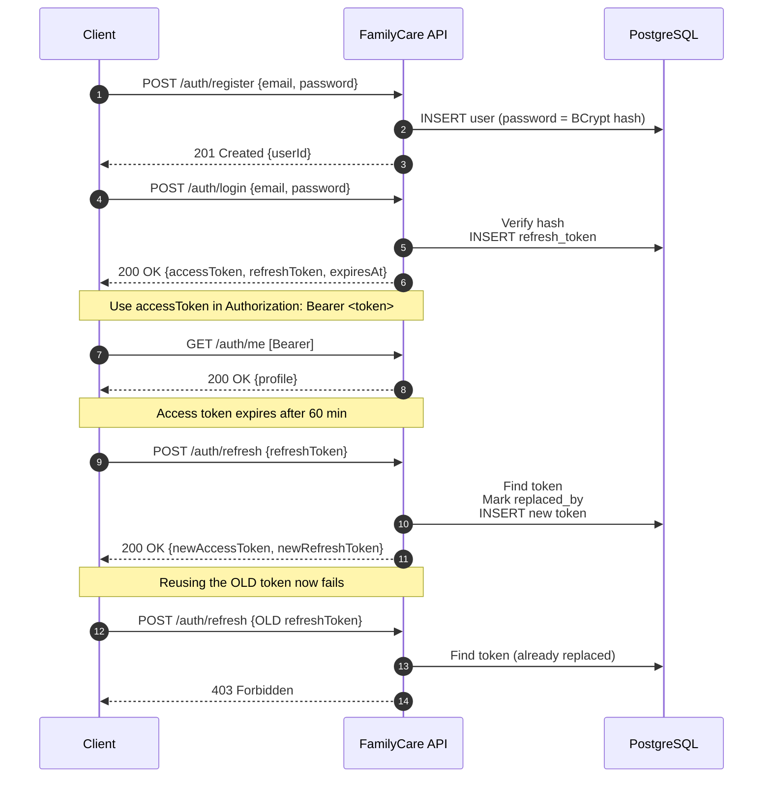
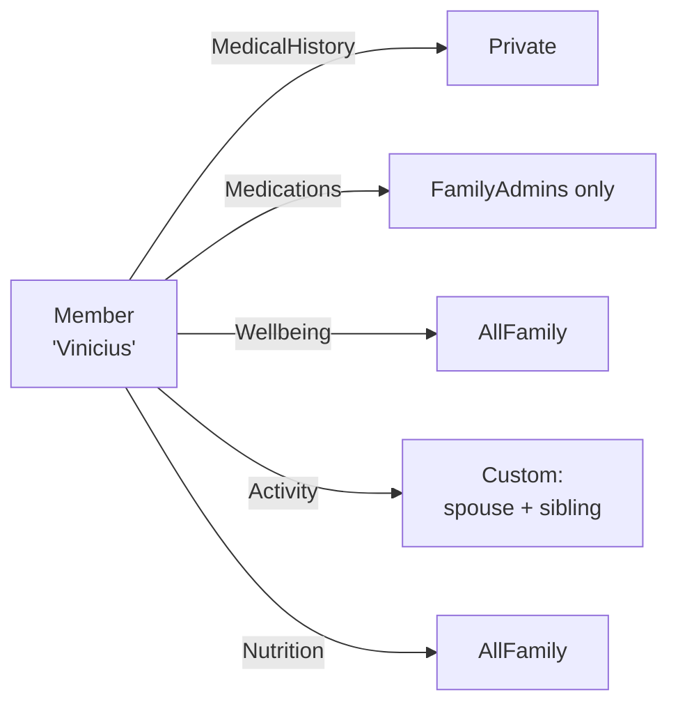

# FamilyCare API 🏥

[](https://github.com/viniciusst/familycare-backend/actions/workflows/ci.yml)
[](LICENSE)
[](https://dotnet.microsoft.com/en-us/download/dotnet/10.0)
[](https://www.postgresql.org/)
[](#testing)
[](docs/ARCHITECTURE.md)

> Production-grade backend for a multi-platform family health and well-being platform.
> Built with **Clean Architecture + DDD + CQRS** on **.NET 10** and **PostgreSQL 17**.

---

## ✨ Highlights

- 🏛️ **Clean Architecture** with strict layer boundaries enforced at the project-reference level
- 🎯 **Domain-Driven Design** with rich aggregates (Family, User, Appointment, ...) and strongly-typed IDs
- ⚡ **CQRS** via MediatR with three pipeline behaviors (Validation → UnitOfWork → Logging)
- 🔐 **JWT + Refresh Token Rotation** with reuse detection
- 🛡️ **Per-category Privacy Engine** — users control which family members can see each data category
- 🌍 **Multi-language API** (pt-BR / en-CA / fr-CA) with RFC 7807 ProblemDetails
- 🧪 **231 automated tests** covering Domain, Application, and full-stack API integration
- 🐳 **Docker-first** local development with `docker compose up`
- 📜 **OpenAPI** (Scalar UI) auto-generated for all 47 endpoints

---

## 🎬 Quick Start

```bash
# 1. Clone
git clone https://github.com/viniciusst/familycare-backend.git
cd familycare-backend

# 2. Start the database, API, and Scalar docs
docker compose up -d

# 3. Open the API docs
open http://localhost:8080/scalar/v1
```

That's it. The API auto-migrates the database on first start.

> **Without Docker?** See [Running locally](#running-locally-without-docker).

---

## 🏗️ Architecture at a glance



**Dependency rule:** `Api → Application → Domain ← Infrastructure → Domain`.
Domain has zero external dependencies. Application depends only on Domain.

For a deeper dive, read [docs/ARCHITECTURE.md](docs/ARCHITECTURE.md).

---

## 🧰 Tech stack

| Layer | Choice | Why |
|---|---|---|
| **Runtime** | .NET 10 (LTS) | Modern C# features, performance, long-term support |
| **API style** | Minimal APIs grouped by feature | Less ceremony than MVC, easy to test |
| **CQRS** | MediatR 12 | Battle-tested pipeline; behaviors separate cross-cutting concerns |
| **Validation** | FluentValidation 11 | Composable validators, automatic via pipeline behavior |
| **Persistence** | EF Core 10 + Npgsql | snake_case via `EFCore.NamingConventions` matches Postgres idioms |
| **Database** | PostgreSQL 17 | Robust ACID, JSONB, full-text, mature ecosystem |
| **Auth** | JWT + refresh tokens | Stateless, rotation with reuse-detection |
| **Password hashing** | BCrypt | Adaptive cost, industry standard |
| **API docs** | OpenAPI + Scalar | Auto-generated, beautiful UI, no manual maintenance |
| **Testing** | xUnit + Moq + Testcontainers + Respawn | Unit + integration with **real Postgres** in containers |
| **CI/CD** | GitHub Actions | Build, test, Docker build on every PR |
| **Dependency management** | Central Package Management (CPM) | Single source of truth for versions across projects |

---

## 🗺️ API surface

47 endpoints across 6 feature areas, all under `/api/v1/`:

| Area | Endpoints | Key flows |
|---|---|---|
| **Auth** | 5 | Register · Login · Refresh · Logout · Me |
| **Families** | 7 | Create · Rename · Transfer ownership · List · Get · Members · Remove |
| **Invitations** | 4 | Invite · Accept · Decline · Revoke |
| **Members** | 3 | Change role · Change privacy rule · List |
| **Medical history** | 24 | Appointments · Exams · Vaccines · Allergies · Chronic conditions · Attachments |
| **Health** | 2 | `/health` · `/health/ready` |

Browse the full surface in Scalar at `http://localhost:8080/scalar/v1` after running `docker compose up`.

---

## 🔐 Authentication flow



**Refresh-token rotation with reuse detection** is the production-recommended pattern: a stolen refresh token becomes invalid the moment the legitimate client rotates it.

---

## 🛡️ Privacy model

Each family member can set, **per data category**, who is allowed to see their information:



Categories: `MedicalHistory`, `Medications`, `Wellbeing`, `Activity`, `Nutrition`.
Scopes: `Private`, `FamilyAdmins`, `AllFamily`, `Custom`.

Every read/write of medical data goes through `MedicalAccessGuard`, which combines the requester's role, the target member's privacy rules, and the data category to authorize or reject.

---

## 🧪 Testing

| Layer | Project | Tests | What it covers |
|---|---|---|---|
| **Domain** | `FamilyCare.Domain.Tests` | 84 | Entity invariants, value object validation, state transitions, domain events |
| **Application** | `FamilyCare.Application.Tests` | 133 | Handlers, validators, behaviors (Validation/UnitOfWork/Logging) with mocked infrastructure |
| **API integration** | `FamilyCare.Api.IntegrationTests` | 14 | Full HTTP round-trips against **real PostgreSQL** via Testcontainers + Respawn |
| **Total** | | **231 ✅** | |

Run them all:

```bash
dotnet test
```

Integration tests require Docker to be running (Testcontainers spawns a Postgres container per test run).

---

## 📂 Repository structure

```text
familycare-backend/
├── src/
│   ├── FamilyCare.Domain/             ← Entities, value objects, domain events
│   │   ├── Common/                    ← StronglyTypedIds, base types
│   │   ├── Identity/                  ← User, RefreshToken, Email, PasswordHash
│   │   ├── FamilyManagement/          ← Family, FamilyMember, Invitation, PrivacyRule
│   │   └── MedicalHistory/            ← Appointment, Exam, Vaccine, Allergy, ...
│   ├── FamilyCare.Application/        ← Commands, queries, handlers, validators
│   │   ├── Common/Behaviors/          ← Validation, UnitOfWork, Logging
│   │   ├── Identity/                  ← Register, Login, Refresh, ChangePassword
│   │   ├── FamilyManagement/          ← Family lifecycle handlers
│   │   └── MedicalHistory/            ← Medical handlers + Privacy authorization
│   ├── FamilyCare.Infrastructure/     ← EF Core, repositories, JWT, hashing
│   │   ├── Persistence/               ← DbContext, Migrations, Configurations
│   │   ├── Identity/Services/         ← AuthTokenService, PasswordHasher
│   │   └── Storage/                   ← Attachment storage (local FS)
│   └── FamilyCare.Api/                ← Minimal API endpoints, middleware
│       ├── Endpoints/V1/              ← 10 endpoint groups
│       ├── Middleware/                ← Exception handling, correlation ID
│       └── Setup/                     ← DI composition, auth, rate limiting, localization
├── tests/                             ← 231 tests across 3 layers
├── docs/
│   └── ARCHITECTURE.md                ← Deep dive into architectural decisions
├── docker-compose.yml                 ← Postgres + API + Scalar
├── Directory.Packages.props           ← Central Package Management
└── Directory.Build.props              ← Shared MSBuild config (analyzers, nullable, etc.)
```

---

## 🏃 Running locally without Docker

You need .NET 10 SDK and a PostgreSQL 17 instance.

```bash
# 1. Start a Postgres locally (or use your own)
docker run -d --name familycare-pg \
  -e POSTGRES_USER=familycare \
  -e POSTGRES_PASSWORD=familycare \
  -e POSTGRES_DB=familycare \
  -p 5432:5432 \
  postgres:17-alpine

# 2. Set connection string
export ConnectionStrings__Postgres="Host=localhost;Port=5432;Database=familycare;Username=familycare;Password=familycare"
export Jwt__Key="your-32-plus-character-secret-key-here"

# 3. Run the API (auto-migrates on startup)
dotnet run --project src/FamilyCare.Api
```

API now at `http://localhost:5000`, Scalar at `http://localhost:5000/scalar/v1`.

---

## 🚧 Roadmap

- [x] Phase 1A–1E — Backend (47 endpoints, JWT, CQRS, privacy engine)
- [x] Phase 1F — Test suite (Domain · Application · API integration)
- [x] Phase 1H — Documentation (you are here)
- [ ] Phase 2 — Next.js web frontend
- [ ] Phase 3 — iOS SwiftUI mobile app
- [ ] Cloud deployment

---

## 📄 License

MIT — see [LICENSE](LICENSE).

---

## 👤 Author

**Vinicius Silva Teixeira** — Principal Software Architect
[LinkedIn](https://linkedin.com/in/vinicius-silva-teixeira-09000032) · [GitHub](https://github.com/viniciusst)
