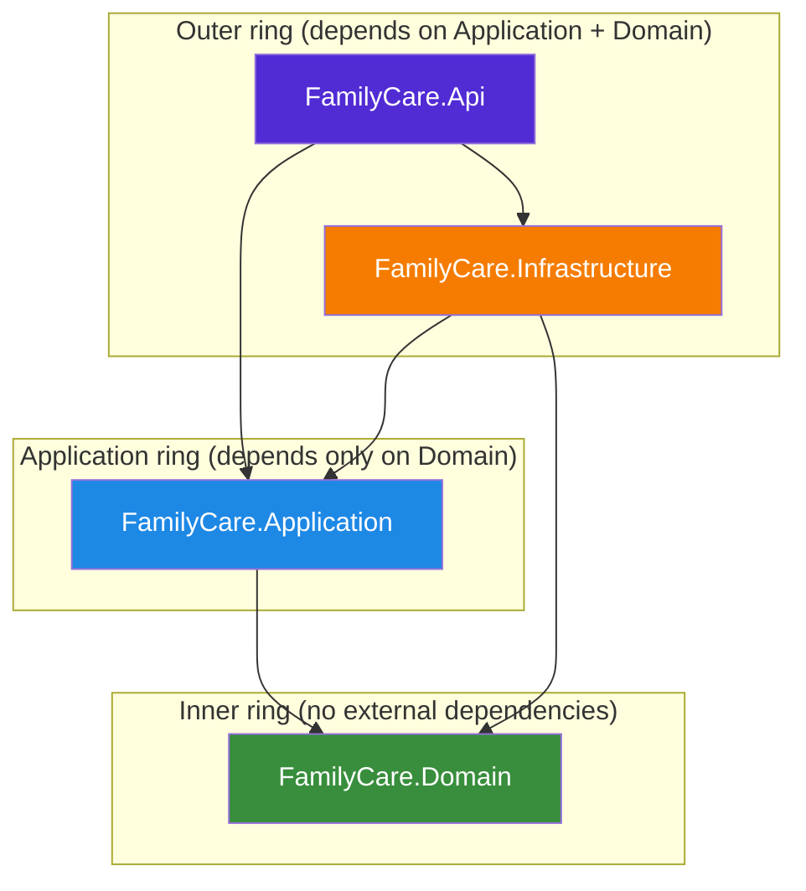
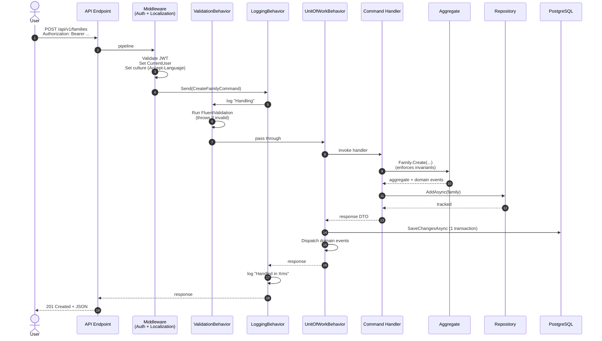
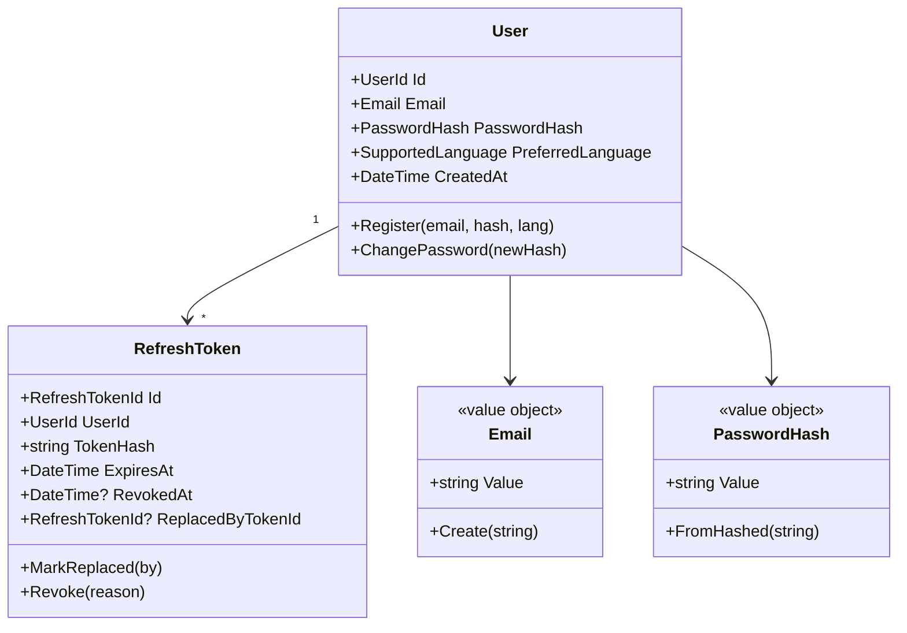
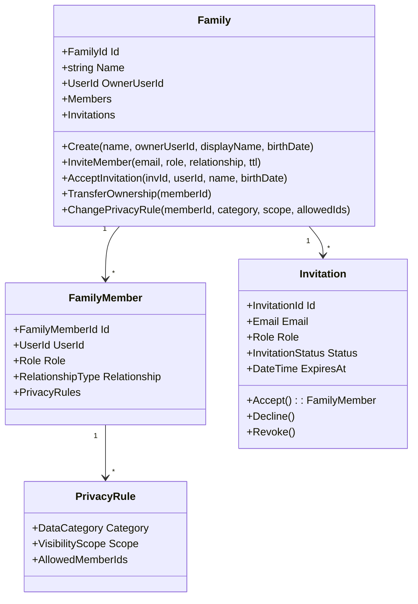
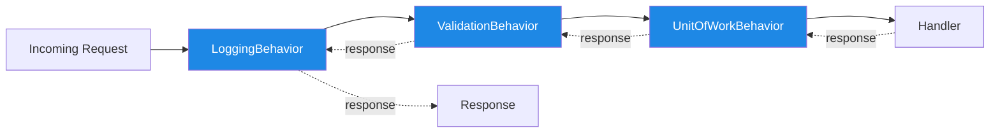

# Architecture

FamilyCare's backend follows **Clean Architecture + Domain-Driven Design (DDD) + CQRS**, with strict layer boundaries enforced at the project-reference level. This document explains why each decision was made and how the layers fit together.

---

## Table of contents

- [Architectural principles](#architectural-principles)
- [Layer breakdown](#layer-breakdown)
- [Request lifecycle](#request-lifecycle)
- [Domain model](#domain-model)
- [Authorization model](#authorization-model)
- [Persistence strategy](#persistence-strategy)
- [Cross-cutting concerns](#cross-cutting-concerns)
- [Testing strategy](#testing-strategy)
- [Trade-offs and conscious decisions](#trade-offs-and-conscious-decisions)

---

## Architectural principles

The codebase is governed by five principles that show up everywhere:

1. **Dependencies point inward.** The Domain knows nothing about the outside world. Application depends only on Domain. Infrastructure depends on both, but the inner layers never reference it directly — they consume **interfaces** that Infrastructure implements.

2. **The Domain is rich, not anemic.** Business rules live inside entities and value objects, not in services. A `Family` enforces its own invariants (an owner can't leave, two members can't share an email, etc.).

3. **Commands change state, queries don't.** The MediatR pipeline distinguishes `ICommand` from `IRequest` — only commands trigger `SaveChanges` and dispatch domain events. This is enforced by the `UnitOfWorkBehavior`.

4. **Validation is automatic.** Every command/query passes through a `ValidationBehavior` that runs all registered FluentValidation validators before the handler executes. Handlers never validate inputs manually.

5. **IDs are typed.** Every aggregate has a strongly-typed ID (`UserId`, `FamilyId`, `AppointmentId`, ...). You cannot pass a `UserId` where a `FamilyMemberId` is expected — the compiler stops you.

---

## Layer breakdown



### `FamilyCare.Domain` — the heart

**Contains:** entities, aggregates, value objects, domain events, strongly-typed IDs, repository **interfaces**, and pure business rules.

**Depends on:** nothing. Not even `Microsoft.Extensions.*`. This is intentional — the Domain compiles in isolation, which makes it inherently testable and reusable.

**Examples:**
- `User` aggregate enforcing email uniqueness and password change rules
- `Family` aggregate managing members, invitations, and privacy rules
- `Email` value object that rejects malformed input at construction
- `Role` enum with `Owner`, `Admin`, `Adult`, `Minor`, `Caregiver`
- `DomainException` raised when an invariant would be violated

### `FamilyCare.Application` — use case orchestration

**Contains:** CQRS commands, queries, handlers, validators, MediatR behaviors, application-layer abstractions (`ICurrentUserService`, `IUnitOfWork`, ...).

**Depends on:** Domain only.

**Has no knowledge of:** HTTP, EF Core, JWT, or any specific technology.

A command handler typically:

1. Resolves the current user via `ICurrentUserService.RequireUserId()`
2. Loads the relevant aggregate from a repository **interface**
3. Calls a method on the aggregate (which enforces invariants and raises domain events)
4. Asks the repository to persist the change
5. Returns a result DTO

That's it. The `UnitOfWorkBehavior` is what actually commits the transaction and dispatches the domain events — the handler never sees `SaveChanges`.

### `FamilyCare.Infrastructure` — the real world

**Contains:** EF Core `DbContext`, entity configurations, migrations, repository **implementations**, JWT service, BCrypt password hasher, file storage, `DateTimeProvider`.

**Depends on:** Application and Domain.

**Why both?** Repository implementations need to know both the interface (defined in Application or Domain) and the entity shape (defined in Domain). Same for `IUnitOfWork`.

This layer is **the only place** where:
- A connection string is read
- An EF Core entity configuration lives
- A JWT is signed
- A password is hashed

### `FamilyCare.Api` — the HTTP edge

**Contains:** Minimal API endpoint definitions (grouped by feature), middleware (exception handling, correlation ID, localization), and the DI composition root.

**Depends on:** Application (for MediatR commands) and Infrastructure (for DI registration).

**Pattern:** every endpoint is a one-liner that builds a command/query and dispatches via MediatR:

```csharp
group.MapPost("/families", async (CreateFamilyCommand cmd, IMediator mediator) =>
{
    var result = await mediator.Send(cmd);
    return Results.Created($"/api/v1/families/{result.FamilyId}", result);
});
```

No business logic lives in endpoints. They are **transport adapters**.

---

## Request lifecycle

The flow of a typical authenticated, validated, transactional request:



If **any** step throws, the `ExceptionHandlingMiddleware` converts it into an RFC 7807 ProblemDetails response with the appropriate HTTP status code and a localized message.

---

## Domain model

Three bounded contexts live inside the Domain assembly:

### Identity



### FamilyManagement



### MedicalHistory

The MedicalHistory context contains independent aggregates owned by a `FamilyMemberId`:

- `Appointment` — scheduled, completed, cancelled, rescheduled
- `Exam` — with optional results (which can be updated later)
- `Vaccine` — with optional dose number and next-dose date
- `Allergy` — with adjustable severity
- `ChronicCondition` — can be marked resolved or reactivated
- `Attachment` — file metadata attached to any of the above

Each aggregate enforces its own state machine (you can't complete a cancelled appointment, you can't resolve an already-resolved condition, etc.).

---

## Authorization model

Authorization happens in two layers:

### Layer 1: Authentication (Api)

Every protected endpoint requires a valid JWT Bearer token. The `JwtBearerHandler` validates issuer, audience, signing key, and lifetime, and populates `HttpContext.User` with claims.

### Layer 2: Permission (Application)

Each handler enforces business permission rules. Two patterns dominate:

**Family-scoped permissions** are checked manually in handlers:

```csharp
var family = await _repo.GetByIdAsync(cmd.FamilyId)
    ?? throw new NotFoundException(...);

var member = family.Members.SingleOrDefault(m => m.UserId == userId)
    ?? throw new ForbiddenException(...);

if (!member.IsAdmin)
    throw new ForbiddenException(...);
```

**Medical-data permissions** go through a centralized `MedicalAccessGuard`:

```csharp
await _guard.EnsureCanWriteAsync(
    cmd.MemberId,
    DataCategory.MedicalHistory,
    cancellationToken);
```

The guard resolves the family, the requester's membership, and consults an `IPrivacyPolicyEvaluator` that returns whether the requester can read/write that specific data category for that specific target member.

### Privacy scopes

| Scope | Who can see |
|---|---|
| `Private` | The data owner only |
| `FamilyAdmins` | Owner + Admin members |
| `AllFamily` | Every member of the family |
| `Custom` | An explicit list of member IDs |

Privacy rules are **per data category** (`MedicalHistory`, `Medications`, `Wellbeing`, `Activity`, `Nutrition`), giving users fine-grained control.

---

## Persistence strategy

### EF Core 10 + Npgsql + snake_case

The `FamilyCareDbContext` registers all entity configurations and applies the `UseSnakeCaseNamingConvention()` extension from `EFCore.NamingConventions`. This means:

- C#: `family.OwnerUserId` → SQL: `families.owner_user_id`
- C#: `FamilyMember` → SQL: `family_members`

No manual `[Column]` attributes needed.

### Strongly-typed IDs

Domain IDs like `UserId(Guid Value)` are persisted as `uuid` in Postgres via value converters configured in `EntityConfigurations/`. This gives you compile-time safety in C# **and** native UUID storage at the database level.

### Migrations

All migrations live in `FamilyCare.Infrastructure/Persistence/Migrations/`. They are applied on application startup by a `DatabaseInitializer` hosted service, which retries up to 15 times to handle slow Postgres startup in container environments.

### Unit of Work

The Application layer defines `IUnitOfWork.SaveChangesAsync(...)`; Infrastructure implements it by delegating to the `DbContext`. The `UnitOfWorkBehavior` calls it exactly once per command, **after** the handler returns, and **before** dispatching domain events.

If the handler throws, `SaveChanges` is never called and the transaction is implicitly rolled back.

---

## Cross-cutting concerns

The three MediatR pipeline behaviors wrap every request in this order:



### `LoggingBehavior`

Logs at Information level when handling starts and ends (with duration). Logs at Error level if the handler throws. Uses source-generated `LoggerMessage` for zero-allocation logging.

### `ValidationBehavior`

Resolves all `IValidator<TRequest>` registrations and runs them in parallel. If **any** fail, aggregates the failures by property name and throws a `ValidationException` that the API middleware converts into a 400 Bad Request with structured errors.

### `UnitOfWorkBehavior`

Distinguishes commands from queries:
- **Command** (`ICommand` or `ICommand<TResponse>`): after the handler returns, commits the transaction via `IUnitOfWork.SaveChangesAsync()`, then dispatches all accumulated domain events.
- **Query** (`IRequest<TResponse>` without `ICommand`): passes through untouched — no commits, no events.

If the handler throws, no commit happens and the events are discarded.

### Other middleware (in the API)

- **`ExceptionHandlingMiddleware`** — maps domain/application exceptions to RFC 7807 ProblemDetails with appropriate HTTP status codes.
- **`CorrelationIdMiddleware`** — assigns a request ID, adds it to the response header (`X-Correlation-Id`) and to the logging scope.
- **Localization** — uses `Accept-Language` header to pick from supported cultures (pt-BR, en-CA, fr-CA). Error messages and validation messages are localized.
- **Rate limiting** — auth endpoints have a 5 req/min policy per IP to throttle brute-force attempts.

---

## Testing strategy

Three layers of tests, with sharply different goals:

| Layer | Goal | Speed | Real dependencies? |
|---|---|---|---|
| **Domain.Tests** (84) | Invariants and state transitions on entities/VOs | ~ms each | None |
| **Application.Tests** (133) | Handler logic, behaviors, validators | ~ms each | Mocked repos and services |
| **Api.IntegrationTests** (14) | Full HTTP round-trip through the entire stack | ~seconds | Real Postgres via Testcontainers |

Integration tests use `WebApplicationFactory<Program>` to host the API in-process, spin up a Postgres 17 container via Testcontainers, and reset data between tests via Respawn. Migrations are applied automatically; no schema-management code lives in the tests.

The integration test factory had to overcome several pitfalls that are worth noting (they're commented in the source):

- `AddInfrastructure` captures the connection string in a closure — the test factory re-registers the `DbContext` with the container URL.
- `AddJwtBearer` captures the signing key in a closure — the test factory `PostConfigure`s the options with the test key.
- The production `DatabaseInitializer` hosted service would retry for 7.5 minutes against a stale connection string — the test factory removes it and applies migrations manually.
- `AddPolicy` on the rate limiter is additive (throws on duplicate names) — the test factory `RemoveAll<IConfigureOptions<RateLimiterOptions>>()` before re-installing a permissive policy.

These are the kind of issues you only discover by actually wiring things together; they're documented in code so the next person doesn't pay the same tax.

---

## Trade-offs and conscious decisions

Every architectural choice involves giving something up. Here are the most important ones:

### Minimal APIs over Controllers

**Chose:** Minimal APIs grouped by feature (`AuthEndpoints.cs`, `FamilyEndpoints.cs`, ...).

**Gave up:** Action filters, model binders with full ceremony.

**Why:** Minimal APIs are faster to write, easier to test (one line per endpoint), and the grouping pattern keeps related routes close. Cross-cutting concerns live in MediatR behaviors instead of filters, which makes them testable without spinning up the HTTP pipeline.

### Strongly-typed IDs

**Chose:** `record struct UserId(Guid Value)` for every aggregate.

**Gave up:** Some JSON serialization simplicity — IDs serialize as `{"value": "..."}` by default.

**Why:** The compile-time safety pays for itself the first time it catches `RemoveMember(someUserId)` when the method expected a `FamilyMemberId`. Both ID types are `Guid` under the hood, but they are not interchangeable.

### Central Package Management

**Chose:** Single `Directory.Packages.props` for all versions, with `CentralPackageTransitivePinningEnabled`.

**Gave up:** Per-project version flexibility.

**Why:** Six projects sharing 40+ packages means version drift is inevitable without CPM. Transitive pinning also makes CVE mitigations (like pinning patched `Azure.Identity` against vulnerabilities introduced by Testcontainers) explicit and reviewable.

### Testcontainers over SQLite or InMemory

**Chose:** Real PostgreSQL 17 in a container for integration tests.

**Gave up:** ~5 seconds of container startup per test run.

**Why:** SQLite and EF Core InMemory don't behave like Postgres. snake_case naming, native UUID storage, JSONB, transaction isolation — none of those are testable on a fake provider. Integration tests that pass on SQLite but break in production are the worst class of bug.

### No CQRS read-side projection

**Chose:** Use the same EF Core model for reads and writes.

**Gave up:** The performance ceiling that comes with dedicated read models.

**Why:** Premature. The system has 47 endpoints and a typical family has ~5 members and a few dozen medical entries. Postgres + EF Core is far from the bottleneck. If a specific query proves too slow, a dedicated read projection can be introduced surgically without rewriting the architecture.

### No event sourcing

**Chose:** Domain events for in-process side effects (notifications, audit), but state is stored in normalized tables.

**Gave up:** Time travel, full audit history, event replay.

**Why:** The complexity tax of event sourcing pays off only when the audit trail or temporal queries are first-class requirements. For a family health app, "what was Mary's prescription on 2024-05-12" is rare enough that a simple `valid_from` / `valid_to` pattern would suffice if we ever need it.

---

## Where to go from here

- Browse the API surface at `http://localhost:8080/scalar/v1` after `docker compose up`
- Read the test code in `tests/` to see how each layer is exercised
- Inspect `src/FamilyCare.Application/Common/Behaviors/` to see the MediatR pipeline in 100 lines
- See `src/FamilyCare.Domain/FamilyManagement/Family.cs` for an example of a rich domain aggregate
